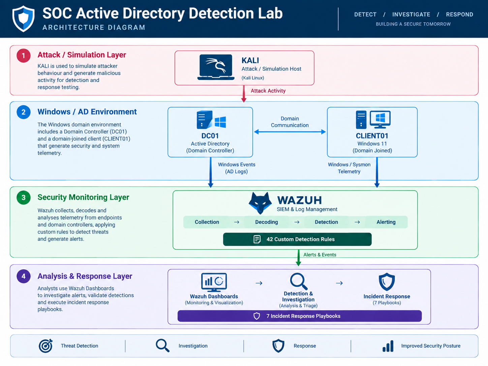

# SOC Active Directory Detection & Incident Response Lab

[](https://learn.microsoft.com/windows-server/identity/ad-ds/)
[](https://wazuh.com/)
[](https://www.microsoft.com/windows-server)
[](https://www.microsoft.com/windows/windows-11)
[](https://learn.microsoft.com/sysinternals/downloads/sysmon)
[](https://attack.mitre.org/)
[](#detection-coverage)
[](#incident-response)

> A hands-on Security Operations Center (SOC) lab for simulating Windows and Active Directory attacks, engineering Wazuh detections, investigating security events, and executing incident response workflows.

---

## Quick Navigation

- [Lab Architecture](docs/architecture.md)
- [Detection Engineering](docs/detection-engineering.md)
- [42 Detection Rules](detection-rules/README.md)
- [Security Dashboards](docs/dashboards.md)
- [MITRE ATT&CK Coverage](docs/mitre-attack.md)
- [Attack Simulations](docs/attack-simulations.md)
- [Incident Response Playbooks](incident-response/README.md)
- [Validation](docs/validation.md)
- [Lessons Learned](docs/lessons-learned.md)

---

## Overview

This project is a self-contained SOC lab built around a Windows Active Directory environment.

The lab demonstrates the security monitoring and response lifecycle:

```text
Attack Simulation
       ↓
Windows / Sysmon Telemetry
       ↓
Wazuh Log Collection
       ↓
Custom Detection Rules
       ↓
SOC Dashboards
       ↓
Alert Triage & Investigation
       ↓
Incident Response
       ↓
Containment
       ↓
Eradication
       ↓
Recovery
       ↓
Validation
```

The primary focus is **Windows and Active Directory security**, with attack activity simulated in an isolated lab environment and investigated using Wazuh.

### Project Highlights

- **42 custom Wazuh detection rules**
- **42 individual detection documents**
- **7 incident-level response playbooks**
- **7 Wazuh SOC Dashboards**
- Windows Security Event Log and Sysmon telemetry collection
- Active Directory attack simulations
- Wazuh SOC dashboards for monitoring and investigation
- MITRE ATT&CK mapping
- Detection validation and troubleshooting documentation
- Detection-to-investigation-to-response workflow documentation
- Architecture, telemetry, network, and attack-chain diagrams

---

## Project Objectives

The main objectives of the lab are to:

- Build a realistic Windows/Active Directory SOC monitoring environment.
- Understand Windows security telemetry and Sysmon events.
- Engineer custom Wazuh detection rules.
- Validate detections against simulated attack activity.
- Investigate alerts using Wazuh Dashboard and SIEM search.
- Correlate related security events into broader incidents.
- Develop operational incident response playbooks.
- Map detections and attack scenarios to MITRE ATT&CK.
- Document the environment and detection workflow for reproducibility.
- Develop practical experience across the detection-to-response lifecycle.

---

## Lab Architecture

The lab consists of four primary systems:

| System | Role |
|---|---|
| **DC01** | Windows Server 2022 / Active Directory Domain Controller |
| **CLIENT01** | Windows 11 domain-joined endpoint |
| **WAZUH** | SIEM, log collection, detection, alerting, and investigation |
| **KALI** | Attack simulation / adversary host |

### High-Level Architecture



The environment separates attack activity, endpoint telemetry, centralized security monitoring, and analyst investigation.

Detailed architecture documentation is available in [`docs/architecture.md`](docs/architecture.md).

Additional network and telemetry diagrams are available in [`diagrams/`](diagrams/).

---

## Technology Stack

| Technology | Purpose |
|---|---|
| **Wazuh** | SIEM, log collection, detection, alerting, and investigation |
| **Wazuh Dashboard** | Security monitoring and investigation dashboards |
| **Windows Server 2022** | Active Directory Domain Controller |
| **Windows 11** | Domain-joined endpoint |
| **Sysmon** | Endpoint process, network, file, registry, and process-access telemetry |
| **Kali Linux** | Attack simulation and adversary activity |
| **Active Directory** | Identity, authentication, authorization, and directory services |
| **Windows Event Logging** | Security and system telemetry |
| **MITRE ATT&CK** | Adversary behavior and technique mapping |

---

## Detection Engineering

The lab contains **42 custom Wazuh detections** covering major Windows and Active Directory security scenarios.

### Detection Coverage

| Category | Detections |
|---|---:|
| Authentication | DET-001 – DET-006 |
| Account Management | DET-007 – DET-010 |
| Privilege Escalation | DET-011 – DET-016 |
| Credential Access & Kerberos | DET-017 – DET-024 |
| Discovery & Reconnaissance | DET-025 – DET-027 |
| Lateral Movement & Remote Execution | DET-028 – DET-032 |
| Persistence & Defense Evasion | DET-033 – DET-041 |
| Impact | DET-042 |
| **Total** | **42** |

Each detection is documented with its:

- Objective
- MITRE ATT&CK mapping
- Windows/Sysmon telemetry
- Detection logic
- Wazuh rule XML
- Rule details
- Simulation method
- Expected alert
- Validation result
- Investigation playbook
- Response playbook
- False positives
- Tuning considerations

The complete detection library is available under [`docs/detections/`](docs/detections/).

The deployable custom Wazuh rules are available under [`detection-rules/Wazuh-Rules.xml`](detection-rules/Wazuh-Rules.xml).

---

## Detection Categories

The detection library is organized into eight security domains:

```text
01 Authentication
        ↓
02 Account Management
        ↓
03 Privilege Escalation
        ↓
04 Credential Access & Kerberos
        ↓
05 Discovery & Reconnaissance
        ↓
06 Lateral Movement & Remote Execution
        ↓
07 Persistence & Defense Evasion
        ↓
08 Impact
```

This organization provides a structured path from identity-related activity through post-compromise behavior and impact.

---

## Security Monitoring Dashboards

The project includes focused Wazuh dashboards designed around common SOC monitoring and investigation questions.

### SOC Detection Overview

Provides a high-level view of:

- Total alerts
- Alert severity
- Detection activity
- Affected hosts
- Affected users
- Alert trends
- Detection categories

### Authentication & Account Monitoring

Provides visibility into:

- Successful logons
- Failed logons
- Account lockouts
- Privileged logons
- Authentication trends
- Failed authentication by user, source, and host

### Active Directory Security

Provides visibility into:

- Account creation and deletion
- Password changes and resets
- Group membership changes
- Privileged group activity
- Active Directory attribute modifications
- Active Directory security detections

### Sysmon Endpoint Activity

Provides endpoint visibility into:

- Process creation
- Network connections
- Process access
- LSASS access
- File creation
- Registry activity
- DNS activity

### Threat Hunting & Lateral Movement

Provides visibility into behaviors associated with:

- PowerShell execution
- Encoded PowerShell
- Suspicious processes
- SharpHound activity
- AdFind enumeration
- Network discovery
- Service creation
- Scheduled tasks
- Startup persistence
- Group Policy modification
- PsExec
- SMB administrative share access
- WinRM activity

### Detection Validation & Engineering

Provides visibility into:

- Custom rule coverage
- Triggered detections
- Detection levels
- Detection IDs
- Affected hosts and users
- Detection activity over time

Dashboard documentation is available in [`docs/dashboards.md`](docs/dashboards.md).

Dashboard screenshots and recordings are available under [`screenshots/`](screenshots/).

---

## Attack Simulation & Validation

Attack simulations are performed inside the isolated lab environment to generate representative Windows and Active Directory telemetry.

The validation workflow follows:

```text
Attack / Test Activity
        ↓
Windows / Sysmon Event
        ↓
Wazuh Collection
        ↓
Custom Detection Rule
        ↓
Wazuh Alert
        ↓
Dashboard Visibility
        ↓
Investigation
        ↓
Response Validation
```

Each detection is validated against representative activity before being considered complete.

Validation work also included troubleshooting telemetry fields, Wazuh rule matching, alert generation, and dashboard visibility.

See [`docs/attack-simulations.md`](docs/attack-simulations.md) for attack simulation documentation and [`docs/validation.md`](docs/validation.md) for the validation methodology.

---

## Incident Response

The 42 detections are grouped into **7 incident-level response scenarios**.

| Playbook | Incident Scenario | Detection Coverage |
|---|---|---|
| IR-001 | Credential Attack & Account Compromise | DET-001 – DET-006 |
| IR-002 | Active Directory Account & Privilege Compromise | DET-007 – DET-016 |
| IR-003 | Kerberos & Credential Theft Attack | DET-017 – DET-024 |
| IR-004 | Active Directory Discovery & Reconnaissance | DET-025 – DET-027 |
| IR-005 | Lateral Movement & Remote Execution | DET-028 – DET-032 |
| IR-006 | Persistence & Defense Evasion | DET-033 – DET-041 |
| IR-007 | AD Destructive & Impact Activity | DET-042 |

The playbooks follow an operational incident-response lifecycle:

```text
Triage
  ↓
Investigation & Correlation
  ↓
Incident Assessment
  ↓
Containment
  ↓
Eradication
  ↓
Recovery & Validation
  ↓
Closure
```

The complete response playbook library is available under [`incident-response/`](incident-response/).

---

## MITRE ATT&CK Mapping

The detection library and attack scenarios are mapped to relevant MITRE ATT&CK tactics and techniques.

The mapping provides visibility into:

- ATT&CK tactics
- ATT&CK techniques
- Detection coverage
- Attack-scenario coverage
- Defensive visibility
- Potential detection gaps

The MITRE documentation is available in [`docs/mitre-attack.md`](docs/mitre-attack.md).

The detection-to-MITRE mapping is available in [`docs/mappings/detection-to-mitre-id.md`](docs/mappings/detection-to-mitre-id.md).

The visual coverage matrix is available in [`diagrams/MITRE-ATT&CK-Coverage-Matrix.png`](diagrams/MITRE-ATT&CK-Coverage-Matrix.png).

---

## Detection-to-Response Model

The project is designed around the relationship between detection engineering and incident response.

```text
                         ATTACK
                           │
                           ▼
                  Windows / Sysmon Events
                           │
                           ▼
                    Wazuh Collection
                           │
                           ▼
                  Custom Detection Rules
                           │
                           ▼
                       Wazuh Alert
                           │
                           ▼
                    SOC Dashboards
                           │
                           ▼
                     Analyst Triage
                           │
                           ▼
                 Correlation & Investigation
                           │
                           ▼
                    Incident Assessment
                           │
                 ┌─────────┴─────────┐
                 ▼                   ▼
              Benign              Malicious
                                     │
                                     ▼
                                Containment
                                     │
                                     ▼
                                Eradication
                                     │
                                     ▼
                                  Recovery
                                     │
                                     ▼
                                 Validation
                                     │
                                     ▼
                                  Closure
```

This separation is intentional:

**Detection documentation** answers:

> How do we detect and investigate this specific behavior?

**Incident response playbooks** answer:

> How do we handle the broader incident when multiple related behaviors are involved?

---

## Documentation

The repository documentation is organized around the major components of the project:

```text
docs/
│
├── architecture.md
├── attack-simulations.md
├── dashboards.md
├── detection-engineering.md
├── incident-response.md
├── lessons-learned.md
├── mitre-attack.md
├── validation.md
│
├── detections/
│   ├── 01-authentication/
│   ├── 02-account-management/
│   ├── 03-privilege-escalation/
│   ├── 04-credential-access-and-kerberos/
│   ├── 05-discovery-and-reconnaissance/
│   ├── 06-lateral-movement-and-remote-execution/
│   ├── 07-persistence-and-defense-evasion/
│   └── 08-impact/
│
└── mappings/
    ├── detection-coverage-matrix.md
    ├── detection-to-event-id.md
    ├── detection-to-mitre-id.md
    └── detection-to-playbook.md
```

The repository also contains:

```text
detection-rules/
    ├── README.md
    └── Wazuh-Rules.xml

incident-response/
    ├── README.md
    └── IR-001 through IR-007

diagrams/
    ├── Architecture-diagram.png
    ├── Network-diagram.png
    ├── Telemetry-Data-Flow-Diagram.png
    ├── Windows-Sysmon-Telemetry-Dataflow-Diagram.png
    ├── Detection-Investigation-Response-Workflow-Diagram.png
    ├── Sample-Attack-Chain-Simulation.png
    └── MITRE-ATT&CK-Coverage-Matrix.png

screenshots/
    ├── Dashboard screenshots and recordings
    └── Detection validation evidence
```

---

## Recommended Learning Path

For someone recreating or studying the lab, the recommended order is:

### 1. Understand the Architecture

Start with [`docs/architecture.md`](docs/architecture.md) to understand the systems, network, and telemetry flow.

### 2. Understand the Detection Engineering Methodology

Review [`docs/detection-engineering.md`](docs/detection-engineering.md) to understand how detections were designed and validated.

### 3. Validate Telemetry

Confirm that Windows Security and Sysmon events are reaching Wazuh before relying on custom detection logic.

### 4. Study the Detection Library

Review [`docs/detections/`](docs/detections/) to understand individual detection objectives, telemetry, logic, validation, investigation, and response.

### 5. Review Attack Simulations

Review [`docs/attack-simulations.md`](docs/attack-simulations.md) to understand how simulated activity generates telemetry and triggers detections.

### 6. Explore the Dashboards

Review [`docs/dashboards.md`](docs/dashboards.md) and the dashboard evidence under [`screenshots/`](screenshots/).

### 7. Follow Incident Response

Review the playbooks under [`incident-response/`](incident-response/) to understand how individual detections can contribute to broader incidents.

### 8. Review MITRE ATT&CK Coverage

Review [`docs/mitre-attack.md`](docs/mitre-attack.md) and the mapping files under [`docs/mappings/`](docs/mappings/).

### 9. Review Lessons Learned

Finish with [`docs/lessons-learned.md`](docs/lessons-learned.md) for engineering challenges, investigation findings, and areas for improvement.

---

## Project Status

| Area | Status |
|---|---|
| Lab Architecture | Complete |
| Windows / Active Directory Environment | Complete |
| Telemetry Collection | Complete |
| Detection Engineering | Complete |
| Custom Wazuh Detections | **42 / 42 Validated** |
| Detection Documentation | Complete |
| SOC Dashboards | Complete |
| Incident Response Playbooks | **7 / 7 Complete** |
| MITRE ATT&CK Mapping | Complete |
| Validation Documentation | Complete |
| Repository Documentation | Complete |

---

## Repository Structure

```text
SOC-Active-Directory-Detection-and-Response-Lab/
│
├── README.md
│
├── detection-rules/
│   ├── README.md
│   └── Wazuh-Rules.xml
│
├── docs/
│   ├── architecture.md
│   ├── attack-simulations.md
│   ├── dashboards.md
│   ├── detection-engineering.md
│   ├── incident-response.md
│   ├── lessons-learned.md
│   ├── mitre-attack.md
│   ├── validation.md
│   │
│   ├── detections/
│   │   ├── 01-authentication/
│   │   ├── 02-account-management/
│   │   ├── 03-privilege-escalation/
│   │   ├── 04-credential-access-and-kerberos/
│   │   ├── 05-discovery-and-reconnaissance/
│   │   ├── 06-lateral-movement-and-remote-execution/
│   │   ├── 07-persistence-and-defense-evasion/
│   │   └── 08-impact/
│   │
│   └── mappings/
│       ├── detection-coverage-matrix.md
│       ├── detection-to-event-id.md
│       ├── detection-to-mitre-id.md
│       └── detection-to-playbook.md
│
├── incident-response/
│   ├── README.md
│   └── IR-001 through IR-007
│
├── diagrams/
│   ├── Architecture-diagram.png
│   ├── Network-diagram.png
│   ├── Telemetry-Data-Flow-Diagram.png
│   ├── Windows-Sysmon-Telemetry-Dataflow-Diagram.png
│   ├── Detection-Investigation-Response-Workflow-Diagram.png
│   ├── Sample-Attack-Chain-Simulation.png
│   └── MITRE-ATT&CK-Coverage-Matrix.png
│
└── screenshots/
    ├── Dashboard screenshots and recordings
    └── Detection validation evidence
```

---

## Lessons Learned

This project is intended to demonstrate practical learning rather than only a successful final configuration.

Key areas of learning include:

- Understanding Windows security event telemetry.
- Working with Sysmon endpoint telemetry.
- Identifying reliable event fields for detection logic.
- Writing and troubleshooting Wazuh rules.
- Validating detections against generated security events.
- Building analyst-focused SOC dashboards.
- Correlating multiple detections into broader incidents.
- Developing practical containment and recovery procedures.
- Understanding the relationship between Active Directory activity and endpoint telemetry.
- Mapping technical detections to MITRE ATT&CK.
- Troubleshooting telemetry, detection, and visualization issues during implementation.

Detailed lessons and challenges are documented in [`docs/lessons-learned.md`](docs/lessons-learned.md).

---

## Future Improvements

Potential future improvements include:

- Expanding detection coverage.
- Increasing telemetry depth for advanced attack techniques.
- Improving detection tuning and reducing false positives.
- Adding additional endpoint telemetry.
- Expanding attack simulation scenarios.
- Improving dashboard investigation workflows.
- Adding more structured evidence collection.
- Performing repeated end-to-end attack-to-response exercises.
- Expanding MITRE ATT&CK coverage based on identified detection gaps.
- Integrating additional security automation and response capabilities.

---

## Disclaimer

This project is intended for **educational and defensive security research purposes**.

All attack simulations should be performed only within an isolated environment where the operator has authorization to conduct security testing.

The techniques demonstrated in this repository should not be used against systems, accounts, networks, or organizations without explicit authorization.

---

## Author

Built as a hands-on SOC, Windows, Active Directory, detection engineering, threat hunting, and incident response learning project.

### Connect With Me

* GitHub: [Harikrishnan-P97](https://github.com/Harikrishnan-P97)
* LinkedIn: [Harikrishnan P](https://www.linkedin.com/in/harikrishnanp097/)
* Medium: [@harikrishnan.p097](https://medium.com/@harikrishnan.p097)