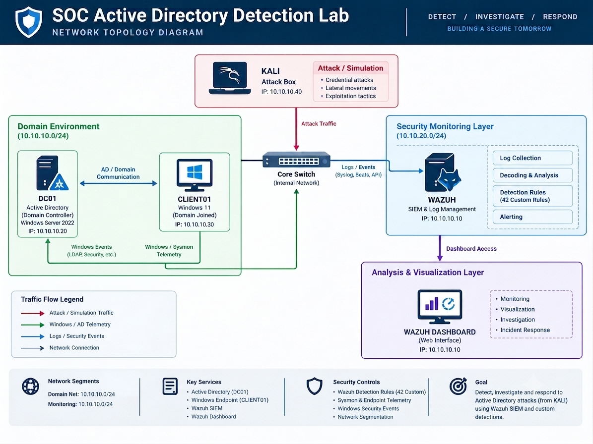
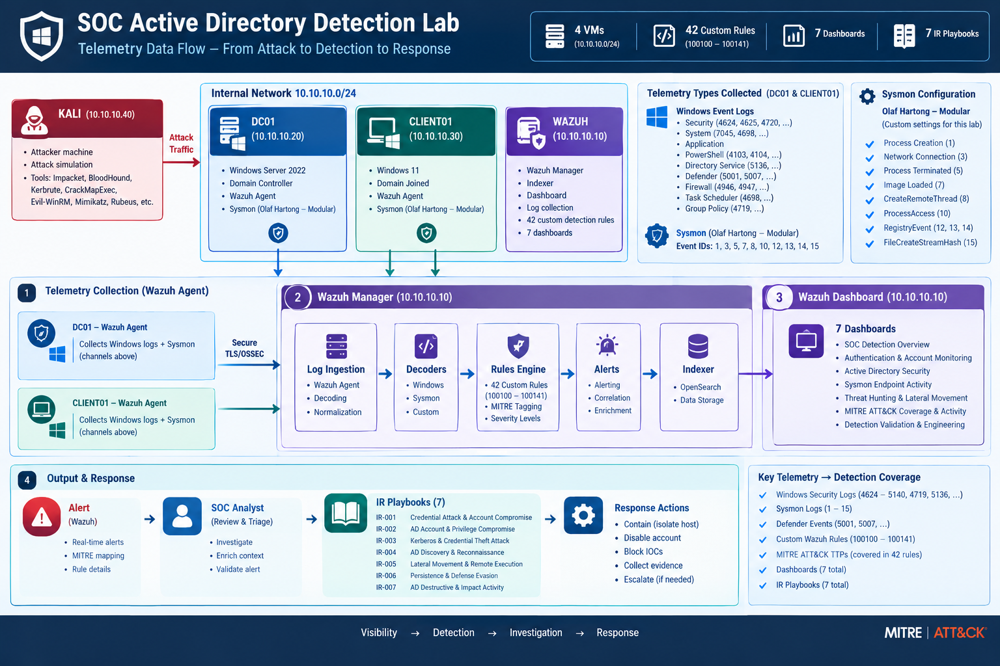
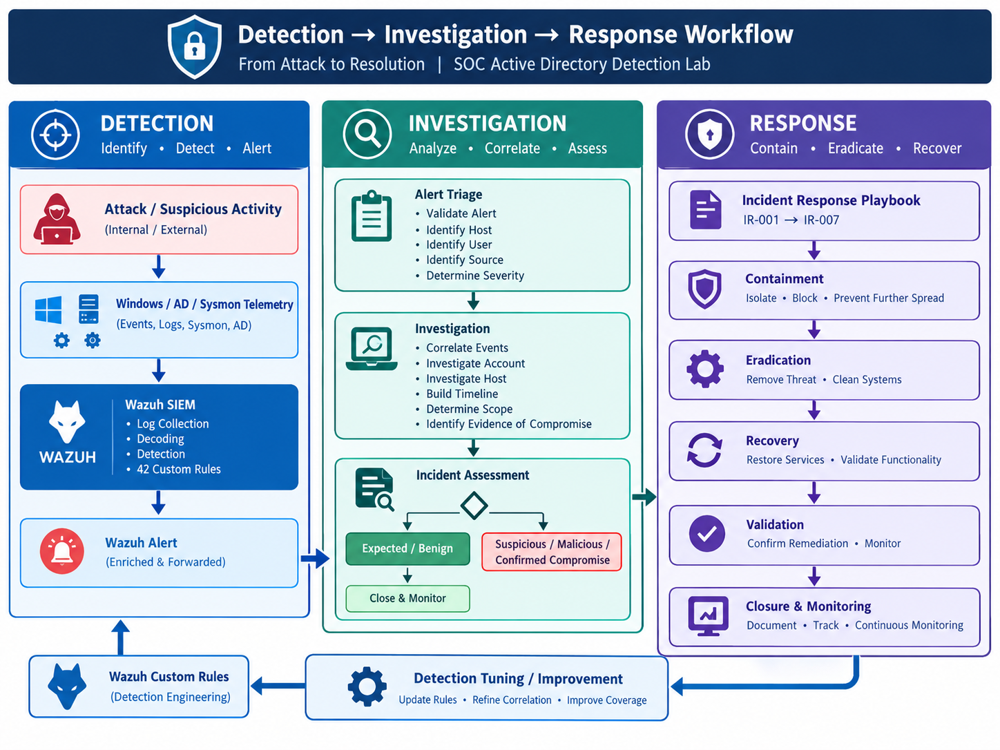
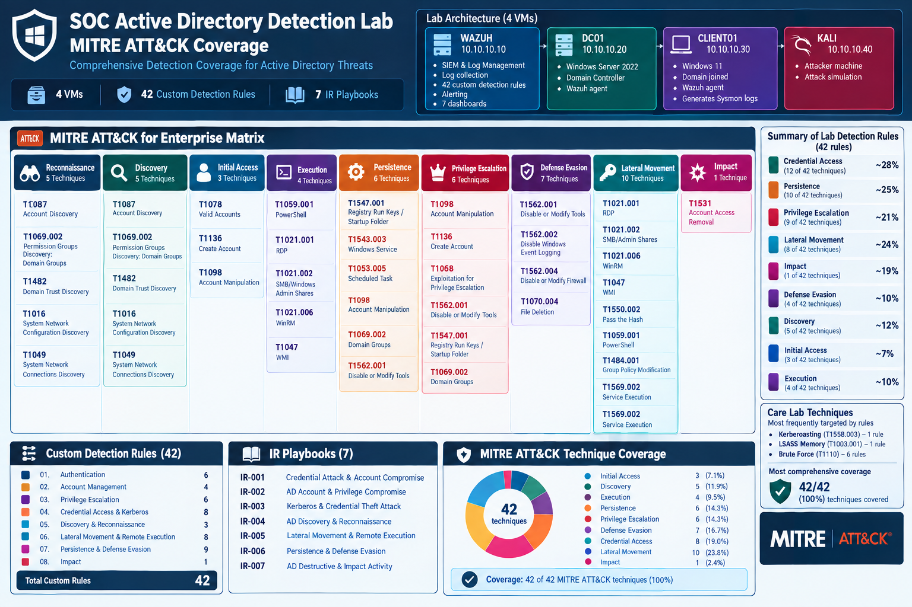
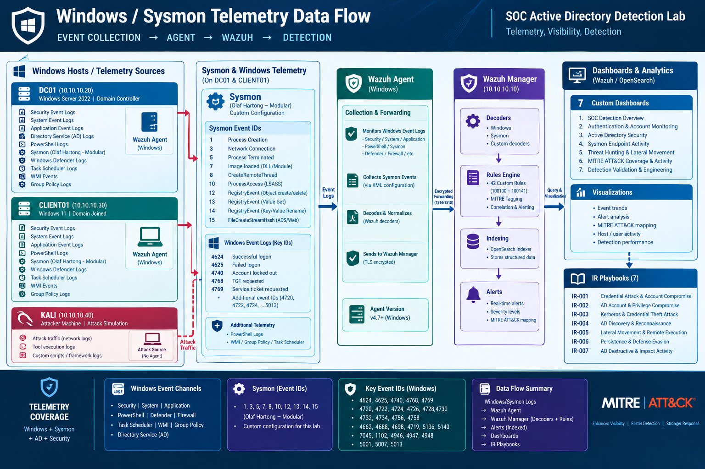
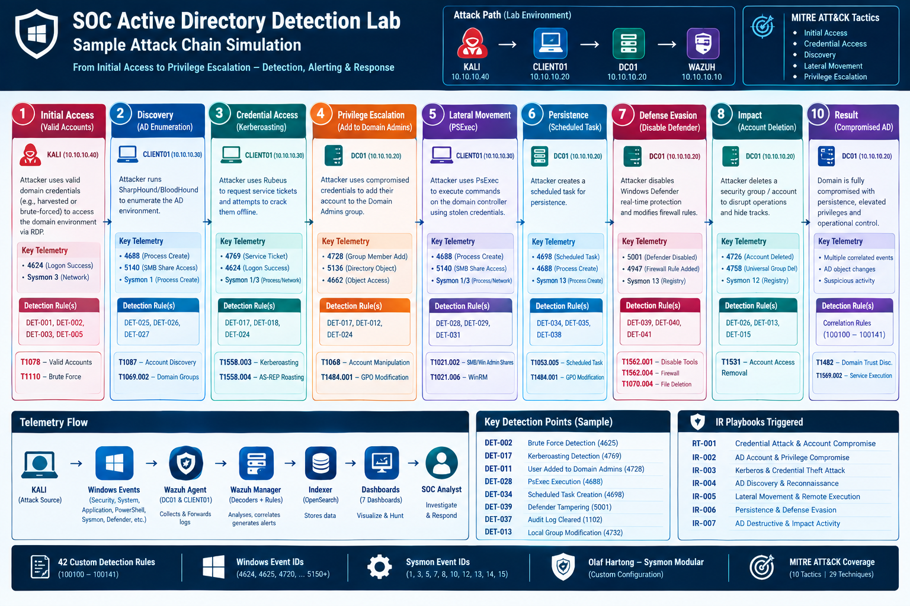

# Project Diagrams

This directory contains the visual documentation for the **SOC Active Directory Detection & Incident Response Lab**.

The diagrams illustrate the lab architecture, network topology, telemetry flow, SOC detection workflow, MITRE ATT&CK coverage, Windows/Sysmon telemetry pipeline, and controlled attack-chain simulations.

---

## 1. Architecture Diagram

High-level architecture of the SOC Active Directory lab, showing the core infrastructure, Active Directory environment, Wazuh SIEM, monitored endpoints, and attack simulation system.

---

## 2. Network Diagram

Network topology of the isolated lab environment, showing the Active Directory domain, Wazuh infrastructure, Windows endpoints, and Kali attack simulation system.

---

## 3. Telemetry / Data Flow Diagram

Overview of how security telemetry is generated by monitored systems and flows into Wazuh for collection, analysis, correlation, and detection.

---

## 4. Detection → Investigation → Response Workflow

End-to-end SOC workflow showing how security telemetry progresses through detection, alert generation, investigation, validation, and response.

---

## 5. MITRE ATT&CK Coverage

Visual mapping of the project's custom detection rules to relevant **MITRE ATT&CK tactics and techniques**.

---

## 6. Windows / Sysmon Telemetry Data Flow

Detailed view of the Windows and Sysmon telemetry pipeline used by the detection environment.

The diagram illustrates how endpoint activity generates Windows and Sysmon events, how telemetry is collected by Wazuh agents, and how the resulting data supports detection and investigation.

---

## 7. Sample Attack Chain Simulation

Example attack-chain simulation demonstrating how controlled adversary activity generates endpoint telemetry and creates detection opportunities across multiple stages of an attack.

---

## Diagram Overview

| # | Diagram | Description |
|---|---|---|
| 1 | **Architecture Diagram** | High-level view of the complete SOC lab architecture |
| 2 | **Network Diagram** | Network topology and communication between lab systems |
| 3 | **Telemetry / Data Flow** | Flow of security telemetry into Wazuh |
| 4 | **Detection → Investigation → Response** | SOC detection and response workflow |
| 5 | **MITRE ATT&CK Coverage** | Mapping of detections to ATT&CK tactics and techniques |
| 6 | **Windows / Sysmon Telemetry Data Flow** | Detailed Windows and Sysmon telemetry pipeline |
| 7 | **Sample Attack Chain Simulation** | Controlled attack activity and associated detection flow |

---

## Purpose

Together, these diagrams provide a visual overview of the project's:

- **SOC architecture**
- **Active Directory environment**
- **Network topology**
- **Windows security monitoring**
- **Sysmon telemetry collection**
- **Wazuh log collection and detection**
- **Detection → Investigation → Response workflow**
- **MITRE ATT&CK coverage**
- **Controlled attack simulations**
- **Detection validation process**

These diagrams complement the technical documentation throughout the repository and provide a visual representation of how the components of the detection lab work together.
