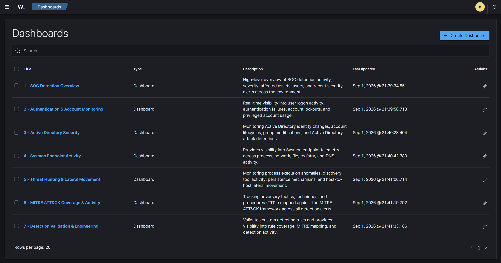
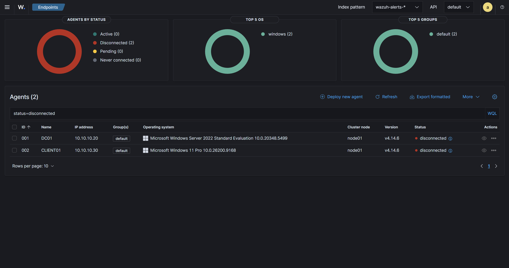

# Wazuh Dashboards

## 1. Overview

The SOC Active Directory Detection Lab uses **Wazuh v4.14.6** dashboards to provide centralized visibility into authentication activity, Active Directory security events, endpoint telemetry, threat-hunting activity, MITRE ATT&CK coverage, and custom detection engineering.

The dashboard environment contains **7 purpose-built dashboards**:

| # | Dashboard | Primary Purpose |
|---|---|---|
| 1 | SOC Detection Overview | High-level SOC detection and alert visibility |
| 2 | Authentication & Account Monitoring | Authentication, logon, account lockout, and privileged account monitoring |
| 3 | Active Directory Security | Active Directory identity, account, group, and privilege monitoring |
| 4 | Sysmon Endpoint Activity | Endpoint process, network, file, registry, and DNS telemetry |
| 5 | Threat Hunting & Lateral Movement | Threat-hunting visibility across execution, discovery, persistence, and lateral movement |
| 6 | MITRE ATT&CK Coverage & Activity | ATT&CK tactic, technique, and detection coverage visibility |
| 7 | Detection Validation & Engineering | Monitoring and validation of the custom detection rule set |

The dashboards are designed to support two complementary activities:

- **SOC monitoring and investigation** — identifying suspicious activity, affected hosts, users, and recent high-severity events.
- **Detection engineering and validation** — measuring custom-rule activity, MITRE mapping, rule coverage, and detection behavior.

---

## 2. SOC Detection Overview

### Purpose

The **SOC Detection Overview** dashboard provides a high-level view of security detection activity across the lab environment. It is intended to give an analyst a rapid understanding of the current alert landscape before moving into more specialized dashboards.

### KPI Row

The dashboard tracks:

- **Total Alerts** — overall alert activity.
- **High/Critical Alerts** — higher-severity detection activity.
- **Active Detections** — detections contributing to current alert activity.
- **Affected Hosts** — hosts associated with detected activity.
- **Affected Users** — users associated with detected activity.

### Main Visualizations

- Alerts Over Time
- Alerts by Severity
- Alerts by Detection Category
- Top Triggered Detections
- Top Affected Hosts
- Top Affected Users
- Recent High-Severity Alerts

### Analyst Use Cases

An analyst can use this dashboard to:

1. Establish an overall view of current detection activity.
2. Identify periods of increased alert activity.
3. Prioritize higher-severity alerts for investigation.
4. Identify hosts or users repeatedly associated with detections.
5. Identify frequently triggered detection rules.
6. Pivot into the specialized dashboards for authentication, Active Directory, endpoint, or threat-hunting investigation.

### Screenshot


---

## 3. Authentication & Account Monitoring

### Purpose

The **Authentication & Account Monitoring** dashboard focuses on user authentication behavior and account-related security activity.

It provides visibility into successful and failed logons, account lockouts, privileged logons, and authentication-related detection activity.

### KPI Row

- **Successful Logons**
- **Failed Logons**
- **Account Lockouts**
- **Privileged Logons**

### Visualizations

- Successful vs Failed Logons
- Failed Logons Over Time
- Failed Logons by User
- Failed Logons by Source IP
- Failed Logons by Host
- Authentication Detection Activity
- Recent Authentication Events

### Analyst Use Cases

This dashboard can be used to:

- Investigate authentication failures.
- Identify repeated failed logons against a user.
- Review authentication activity associated with a source IP.
- Identify hosts generating authentication activity.
- Investigate account lockout activity.
- Review privileged account logons.
- Correlate authentication events with authentication detections.

### Relevant Telemetry

The lab's authentication monitoring includes Windows security authentication events such as:

- Event ID 4624 — Successful Logon
- Event ID 4625 — Failed Logon
- Event ID 4740 — User Account Locked Out
- Event ID 4768 — Kerberos Authentication Ticket (TGT) Requested
- Event ID 4769 — Kerberos Service Ticket Requested

### Screenshot


---

## 4. Active Directory Security

### Purpose

The **Active Directory Security** dashboard provides visibility into identity and directory-security activity within the Active Directory environment.

It focuses on account lifecycle changes, password activity, group membership changes, privileged group activity, directory attribute modifications, and AD-related detections.

### KPI Row

- **User Accounts Created**
- **User Accounts Deleted**
- **Password Changes/Resets**
- **Privilege/Group Changes**

### Visualizations

- AD Account Activity Over Time
- User Creation vs Deletion
- Password Reset Activity
- Group Membership Changes
- Privileged Group Changes
- AD Attribute Modifications
- AD Attack Detections
- Recent AD Security Events

### Analyst Use Cases

This dashboard can be used to:

- Monitor creation and deletion of user accounts.
- Review password reset activity.
- Investigate group membership changes.
- Monitor changes involving privileged groups.
- Identify Active Directory attribute modifications.
- Review recent AD-related security detections.
- Investigate identity and privilege changes alongside authentication activity.

### Relevant Windows Event Coverage

The Active Directory monitoring design includes account and group management events such as:

- Event ID 4720 — User Account Created
- Event ID 4722 — User Account Enabled
- Event ID 4724 — Password Reset Attempt
- Event ID 4726 — User Account Deleted
- Event ID 4728 — Member Added to Security-Enabled Global Group
- Event ID 4730 — Security-Enabled Global Group Deleted
- Event ID 4732 — Member Added to Security-Enabled Local Group
- Event ID 4734 — Security-Enabled Local Group Deleted
- Event ID 4756 — Member Added to Security-Enabled Universal Group
- Event ID 4758 — Security-Enabled Universal Group Deleted

### Screenshot


---

## 5. Sysmon Endpoint Activity

### Purpose

The **Sysmon Endpoint Activity** dashboard provides visibility into endpoint telemetry collected through Sysmon.

The dashboard is organized around process, network, process-access, file, registry, and DNS activity.

### Process Activity

- Process Creation Over Time
- Top Processes
- Process Creation by Host

### Network Activity

- Network Connections Over Time
- Top Destination IPs
- Top Destination Ports

### Process Access

- Process Access Events
- LSASS Access Activity

### File Activity

- File Creation Activity
- Suspicious File Paths

### Registry Activity

- Registry Activity Over Time
- Top Modified Registry Paths

### DNS Activity

- DNS Queries Over Time
- Top Queried Domains

### Analyst Use Cases

This dashboard can be used to:

- Review endpoint process execution patterns.
- Identify frequently executed processes.
- Compare process activity across hosts.
- Investigate network connection activity.
- Review destination IPs and ports.
- Investigate process access involving sensitive processes such as LSASS.
- Review suspicious file creation and file paths.
- Investigate registry modifications.
- Review DNS query activity and commonly queried domains.

### Screenshot


---

## 6. Threat Hunting & Lateral Movement

### Purpose

The **Threat Hunting & Lateral Movement** dashboard provides investigation-oriented visibility into execution, discovery, persistence, and host-to-host activity.

It brings together telemetry associated with several stages of attack activity so an analyst can investigate suspicious behavior across multiple techniques.

### Execution

- PowerShell Activity
- Encoded PowerShell Activity
- Suspicious Process Execution

### Discovery

- SharpHound Activity
- AdFind Activity
- Network Discovery Activity

### Persistence

- Service Creation
- Scheduled Tasks
- Startup Persistence
- Group Policy Modification

### Lateral Movement

- PsExec Activity
- SMB Admin Share Activity
- WinRM Activity
- WMI/RDP Activity

### Analyst Use Cases

This dashboard can be used to:

- Hunt for suspicious PowerShell activity.
- Investigate encoded PowerShell activity.
- Review suspicious process execution.
- Identify directory and network discovery activity.
- Investigate SharpHound/BloodHound collector activity.
- Investigate AdFind enumeration activity.
- Review service and scheduled-task creation.
- Investigate startup persistence.
- Review Group Policy modification activity.
- Investigate PsExec, SMB administrative-share, WinRM, WMI, and RDP activity.

### Screenshot


---

## 7. MITRE ATT&CK Coverage & Activity

### Purpose

The **MITRE ATT&CK Coverage & Activity** dashboard provides visibility into detection activity mapped to the MITRE ATT&CK framework.

It allows analysts and detection engineers to view activity at the tactic and technique levels and examine the relationship between detections and ATT&CK techniques.

### KPI Row

- **ATT&CK Techniques Covered**
- **ATT&CK Tactics Covered**
- **ATT&CK-Mapped Alerts**

### Visualizations

- Alerts by ATT&CK Tactic
- Alerts by ATT&CK Technique
- Technique Activity Over Time
- Top ATT&CK Techniques
- Detection → Technique Mapping
- ATT&CK Technique Table

### Analyst Use Cases

This dashboard can be used to:

- Review which ATT&CK tactics are represented in detected activity.
- Review activity associated with individual ATT&CK techniques.
- Track technique activity over time.
- Identify techniques generating detection activity.
- Review the relationship between detections and ATT&CK techniques.
- Support coverage analysis during detection engineering.

### Screenshot


---

## 8. Detection Validation & Engineering

### Purpose

The **Detection Validation & Engineering** dashboard supports monitoring and validation of the lab's custom detection rule set.

The dashboard contains metrics for the custom rules, rule-trigger activity, validation coverage, and MITRE mapping.

### KPI Row

- **Total Custom Rules — 42**
- **Rules Triggered**
- **Validation Coverage**
- **MITRE-Mapped Rules**

### Visualizations

- Rule Level Distribution
- Alerts by Detection ID
- Alerts by Host
- Alerts by User
- Alerts Over Time

### Analyst and Detection-Engineering Use Cases

This dashboard can be used to:

- Confirm activity from the custom detection rules.
- Review which detection IDs are generating alerts.
- Examine rule-level distribution.
- Identify hosts associated with detection activity.
- Identify users associated with detection activity.
- Review detection activity over time.
- Monitor the implemented 42-rule detection set.
- Support validation of custom detection behavior.
- Review detection activity alongside MITRE ATT&CK mappings.

### Screenshot


---

## 9. Key KPIs and Visualizations

The dashboard suite uses KPI cards and visualizations to provide both high-level situational awareness and detailed investigation context.

### High-Level SOC KPIs

| KPI | Dashboard |
|---|---|
| Total Alerts | SOC Detection Overview |
| High/Critical Alerts | SOC Detection Overview |
| Active Detections | SOC Detection Overview |
| Affected Hosts | SOC Detection Overview |
| Affected Users | SOC Detection Overview |
| Successful Logons | Authentication & Account Monitoring |
| Failed Logons | Authentication & Account Monitoring |
| Account Lockouts | Authentication & Account Monitoring |
| Privileged Logons | Authentication & Account Monitoring |

### Active Directory KPIs

| KPI | Dashboard |
|---|---|
| User Accounts Created | Active Directory Security |
| User Accounts Deleted | Active Directory Security |
| Password Changes/Resets | Active Directory Security |
| Privilege/Group Changes | Active Directory Security |

### MITRE and Detection Engineering KPIs

| KPI | Dashboard |
|---|---|
| ATT&CK Techniques Covered | MITRE ATT&CK Coverage & Activity |
| ATT&CK Tactics Covered | MITRE ATT&CK Coverage & Activity |
| ATT&CK-Mapped Alerts | MITRE ATT&CK Coverage & Activity |
| Total Custom Rules | Detection Validation & Engineering |
| Rules Triggered | Detection Validation & Engineering |
| Validation Coverage | Detection Validation & Engineering |
| MITRE-Mapped Rules | Detection Validation & Engineering |

### Core Visualization Types

Across the dashboard suite, the main visualization patterns include:

- Time-series activity
- Severity distributions
- Detection-category distributions
- Top detections
- Top affected hosts
- Top affected users
- User/source/host authentication breakdowns
- Account lifecycle activity
- Group and privilege changes
- Process activity
- Network activity
- File and registry activity
- DNS activity
- Threat-hunting activity
- ATT&CK tactic and technique activity
- Detection-to-technique relationships
- Rule-level and detection-ID activity

---

## 10. Dashboard Purpose and Analyst Workflow

The dashboards are designed to support a progressive investigation workflow.

```text
SOC Detection Overview
        |
        +--------------------+
        |                    |
        v                    v
Authentication          Active Directory
Monitoring              Security
        |                    |
        +---------+----------+
                  |
                  v
        Sysmon Endpoint Activity
                  |
                  v
      Threat Hunting & Lateral
             Movement
                  |
                  v
       MITRE ATT&CK Coverage
                  |
                  v
      Detection Validation &
           Engineering
```

### Typical Analyst Workflow

1. **Start with SOC Detection Overview**
   - Review alert volume and severity.
   - Identify affected hosts and users.
   - Identify frequently triggered detections.

2. **Pivot into Authentication or Active Directory**
   - Investigate authentication failures.
   - Review account lockouts.
   - Examine account, group, and privilege changes.

3. **Pivot into Sysmon Endpoint Activity**
   - Investigate process execution.
   - Review network connections.
   - Examine process access, file, registry, and DNS activity.

4. **Use Threat Hunting & Lateral Movement**
   - Investigate suspicious execution.
   - Review discovery activity.
   - Investigate persistence and lateral movement behavior.

5. **Review MITRE ATT&CK Coverage & Activity**
   - Identify associated tactics and techniques.
   - Examine detection-to-technique relationships.

6. **Use Detection Validation & Engineering**
   - Review which custom rules triggered.
   - Examine rule activity and levels.
   - Validate detection behavior and coverage.

---

## 11. Dashboard Screenshots and Recordings

The dashboard screenshots and recordings are stored in the repository's root-level `screenshots/` directory.

Current structure:

```text
screenshots/
├── Active-Directory-Security.gif
├── Authentication-And-Account-Monitoring.gif
├── Dashboards.png
├── Detection-Validation-And-Engineering.gif
├── Endpoints.png
├── MITRE-ATT&CK-Coverage-And-Activity.gif
├── SOC-Detection-Overview.gif
├── Sysmon-Endpoint-Activity.gif
└── Threat-Hunting-And-Lateral-Movement.gif
```

The dashboard GIFs provide a visual record of the individual Wazuh dashboards and their configured KPI cards and visualizations.

### Dashboard Inventory

The `Dashboards.png` image provides an overview of the dashboard list in Wazuh and shows the seven dashboards configured for the lab.



### 1. SOC Detection Overview


This recording corresponds to the **SOC Detection Overview** dashboard documented in [Section 2](#2-soc-detection-overview).

### 2. Authentication & Account Monitoring


This recording corresponds to the **Authentication & Account Monitoring** dashboard documented in [Section 3](#3-authentication--account-monitoring).

### 3. Active Directory Security


This recording corresponds to the **Active Directory Security** dashboard documented in [Section 4](#4-active-directory-security).

### 4. Sysmon Endpoint Activity


This recording corresponds to the **Sysmon Endpoint Activity** dashboard documented in [Section 5](#5-sysmon-endpoint-activity).

### 5. Threat Hunting & Lateral Movement


This recording corresponds to the **Threat Hunting & Lateral Movement** dashboard documented in [Section 6](#6-threat-hunting--lateral-movement).

### 6. MITRE ATT&CK Coverage & Activity


This recording corresponds to the **MITRE ATT&CK Coverage & Activity** dashboard documented in [Section 7](#7-mitre-attck-coverage--activity).

### 7. Detection Validation & Engineering


This recording corresponds to the **Detection Validation & Engineering** dashboard documented in [Section 8](#8-detection-validation--engineering).

### Additional Screenshot

The repository also contains:



This image is retained as an additional project screenshot. It is not assigned to one of the seven dashboard sections because its specific dashboard context is not established by the dashboard inventory.

### GitHub Rendering

The GIF files are referenced directly from `docs/dashboards.md` using relative paths. When the repository is viewed on GitHub, the GIFs can be displayed inline and provide an animated view of each dashboard.

The dashboard inventory image and individual dashboard recordings therefore serve as the visual documentation for the Wazuh dashboard environment.

---

## 12. Wazuh Environment

| Component | Value |
|---|---|
| Wazuh Version | 4.14.6 |
| Dashboard Count | 7 |
| Custom Detection Rules | 42 |
| Dashboard Platform | Wazuh Dashboard |

The dashboards are part of the SOC Active Directory Detection Lab and provide the visualization layer for the telemetry and detection engineering workflow documented elsewhere in the repository.

---

## 13. Relationship to Detection Engineering

The dashboards complement the detection engineering lifecycle used in the project:

```text
Threat / ATT&CK Technique
        ↓
Windows / Sysmon Telemetry
        ↓
Custom Wazuh Detection Rule
        ↓
Alert Generation
        ↓
Dashboard Visibility
        ↓
Investigation / Validation
        ↓
Detection Tuning
```

Dashboard visibility therefore provides the analyst-facing layer between generated detections and investigation or validation activities.

The **Detection Validation & Engineering** and **MITRE ATT&CK Coverage & Activity** dashboards also provide dedicated views for evaluating the behavior and coverage of the custom detection rule set.

---

## 14. Summary

The Wazuh dashboard environment consists of seven specialized dashboards covering:

- SOC-wide detection activity
- Authentication and account monitoring
- Active Directory security
- Sysmon endpoint telemetry
- Threat hunting and lateral movement
- MITRE ATT&CK coverage and activity
- Detection validation and engineering

Together, these dashboards provide a structured visualization layer for the SOC Active Directory Detection Lab, supporting both security-operations investigation and detection-engineering validation.
